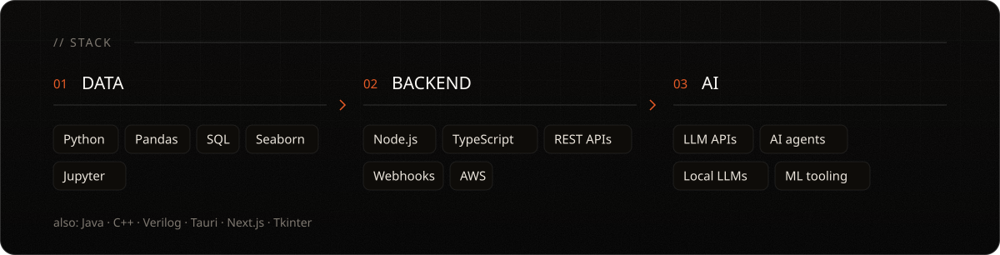
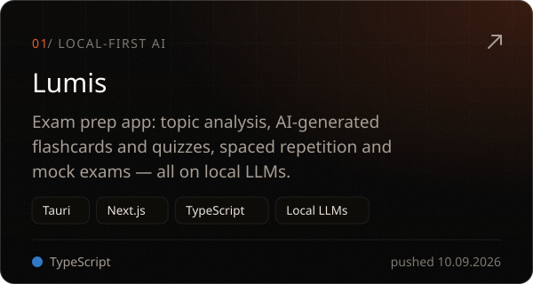
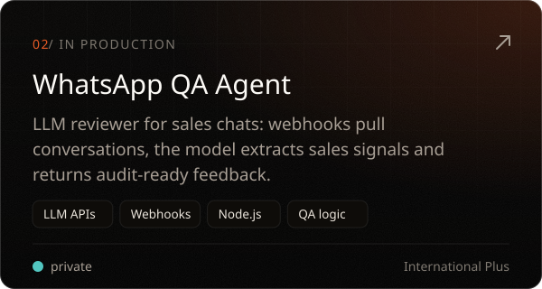
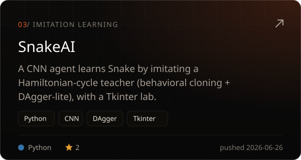
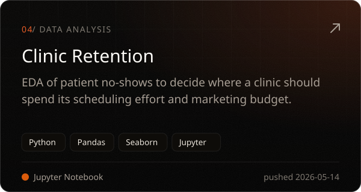

<b>EN</b> · <a href="README.ru.md">RU</a>

I build backend systems that connect AI to real operations: LLM integrations, webhooks and automation that take manual work off people. The data-first habit comes from a year as a Data Scientist at **Yandex**. Today I'm a Backend Engineer (AI & Automation) at **International Plus** in Istanbul and study Computer Engineering at **Istanbul Topkapı University**.

  
  
  
  

Also on GitHub: <a href="https://github.com/m4rkellkka/Minesweeper_FX">Minesweeper_FX</a> (JavaFX) · <a href="https://github.com/m4rkellkka/priority-encoder-8to3">priority-encoder-8to3</a> (Verilog)

<picture>
  <source media="(prefers-color-scheme: dark)" srcset="https://raw.githubusercontent.com/m4rkellkka/m4rkellkka/output/snake-dark.svg" />
  
</picture>

  <a href="https://m4rkellkka.github.io/m4rkellkka/"><b>Resume</b></a> ·
  <a href="https://linkedin.com/in/mikhail-savushkin-993a33408"><b>LinkedIn</b></a> ·
  <a href="mailto:savushkinwork@gmail.com"><b>savushkinwork@gmail.com</b></a>

This profile rebuilds itself every morning: <a href=".github/workflows/profile.yml">profile.yml</a> → <a href="scripts/build_profile.py">build_profile.py</a>

