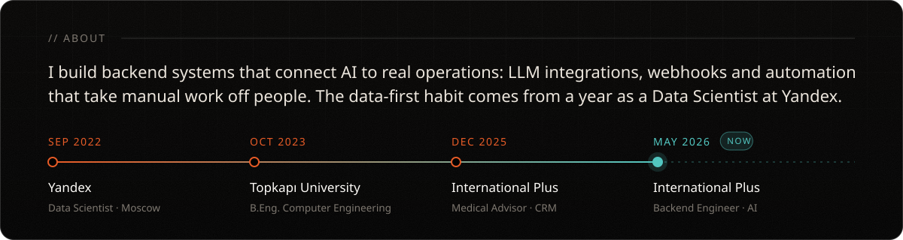
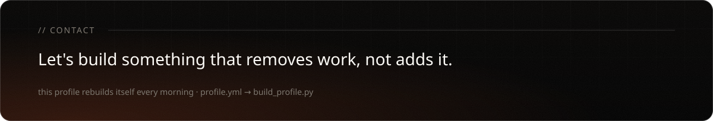
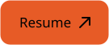

<b>EN</b> · <a href="README.ru.md">RU</a>

  
  
  
  

<picture>
  <source media="(prefers-color-scheme: dark)" srcset="https://raw.githubusercontent.com/m4rkellkka/m4rkellkka/output/snake-dark.svg" />
  
</picture>

  
  
  

