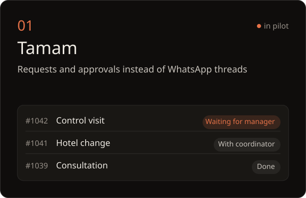
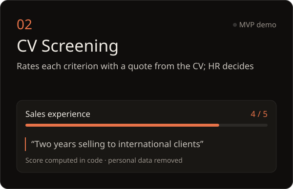
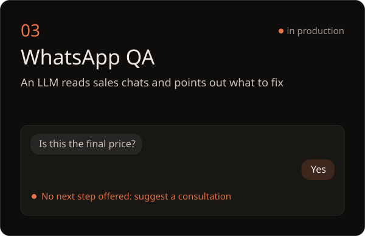
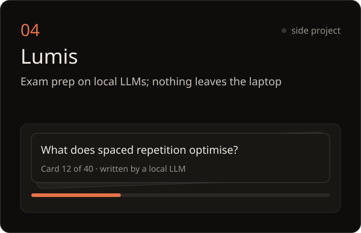
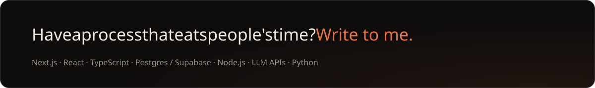

<b>EN</b> · <a href="README.ru.md">RU</a>

  
  
  
  

<picture>
  <source media="(prefers-color-scheme: dark)" srcset="https://raw.githubusercontent.com/m4rkellkka/m4rkellkka/output/snake-dark.svg" />
  
</picture>

<a href="https://m4rkellkka.github.io/m4rkellkka/">Website</a> · <a href="https://m4rkellkka.github.io/m4rkellkka/assets/mikhail-savushkin-resume.pdf">CV (PDF)</a> · <a href="https://linkedin.com/in/mikhail-savushkin-993a33408">LinkedIn</a> · <a href="mailto:savushkinwork@gmail.com">savushkinwork@gmail.com</a>

