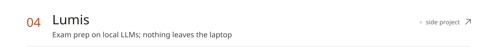

<b>EN</b> · <a href="README.ru.md">RU</a>

<picture>
  <source media="(prefers-color-scheme: dark)" srcset="assets/profile/hero.en.dark.svg" />
  
</picture>

  <a href="https://m4rkellkka.github.io/m4rkellkka/">
    <picture>
      <source media="(prefers-color-scheme: dark)" srcset="assets/profile/work-tamam.en.dark.svg" />
      
    </picture>
  </a>
  <a href="https://m4rkellkka.github.io/m4rkellkka/">
    <picture>
      <source media="(prefers-color-scheme: dark)" srcset="assets/profile/work-cv-screening.en.dark.svg" />
      
    </picture>
  </a>
  <a href="https://m4rkellkka.github.io/m4rkellkka/">
    <picture>
      <source media="(prefers-color-scheme: dark)" srcset="assets/profile/work-whatsapp-qa.en.dark.svg" />
      
    </picture>
  </a>
  <a href="https://github.com/m4rkellkka/Lumis">
    <picture>
      <source media="(prefers-color-scheme: dark)" srcset="assets/profile/work-lumis.en.dark.svg" />
      
    </picture>
  </a>

<picture>
  <source media="(prefers-color-scheme: dark)" srcset="assets/profile/footer.en.dark.svg" />
  
</picture>

<a href="https://m4rkellkka.github.io/m4rkellkka/">Website</a> · <a href="https://m4rkellkka.github.io/m4rkellkka/assets/mikhail-savushkin-resume.pdf">CV (PDF)</a> · <a href="https://linkedin.com/in/mikhail-savushkin-993a33408">LinkedIn</a> · <a href="mailto:savushkinwork@gmail.com">savushkinwork@gmail.com</a>

