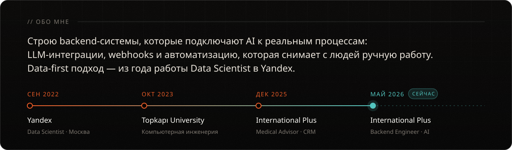
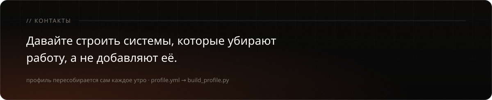
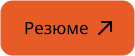

<a href="README.md">EN</a> · <b>RU</b>

  
  
  
  

<picture>
  <source media="(prefers-color-scheme: dark)" srcset="https://raw.githubusercontent.com/m4rkellkka/m4rkellkka/output/snake-dark.svg" />
  
</picture>

  
  
  

