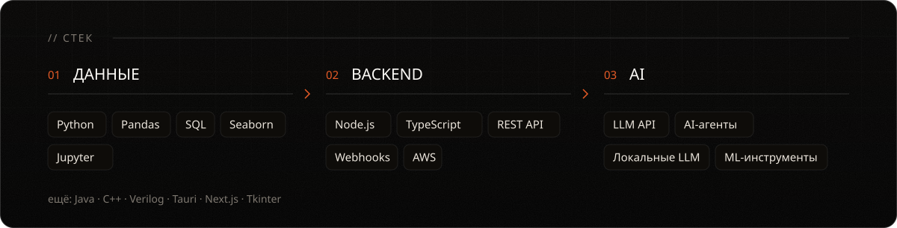
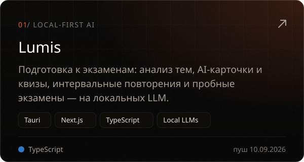
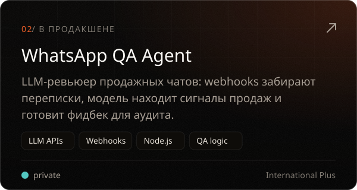
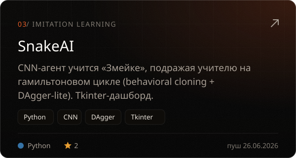
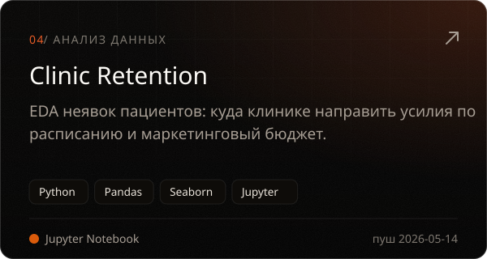

<a href="README.md">EN</a> · <b>RU</b>

Строю backend-системы, которые подключают AI к реальным процессам: LLM-интеграции, webhooks и автоматизацию, которая снимает с людей ручную работу. Data-first подход — из года работы Data Scientist в **Yandex**. Сейчас я Backend Engineer (AI & Automation) в **International Plus** в Стамбуле и учусь на компьютерного инженера в **Istanbul Topkapı University**.

  
  
  
  

Ещё на GitHub: <a href="https://github.com/m4rkellkka/Minesweeper_FX">Minesweeper_FX</a> (JavaFX) · <a href="https://github.com/m4rkellkka/priority-encoder-8to3">priority-encoder-8to3</a> (Verilog)

<picture>
  <source media="(prefers-color-scheme: dark)" srcset="https://raw.githubusercontent.com/m4rkellkka/m4rkellkka/output/snake-dark.svg" />
  
</picture>

  <a href="https://m4rkellkka.github.io/m4rkellkka/"><b>Резюме</b></a> ·
  <a href="https://linkedin.com/in/mikhail-savushkin-993a33408"><b>LinkedIn</b></a> ·
  <a href="mailto:savushkinwork@gmail.com"><b>savushkinwork@gmail.com</b></a>

Профиль пересобирается сам каждое утро: <a href=".github/workflows/profile.yml">profile.yml</a> → <a href="scripts/build_profile.py">build_profile.py</a>

